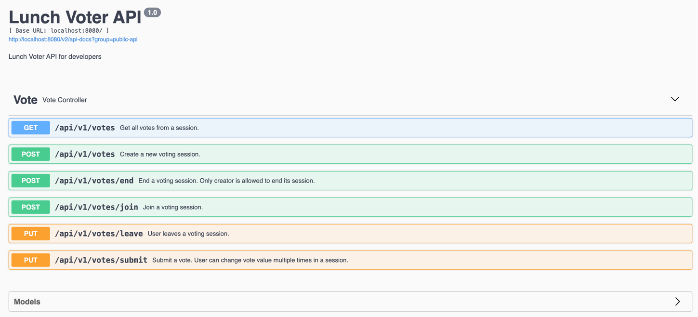
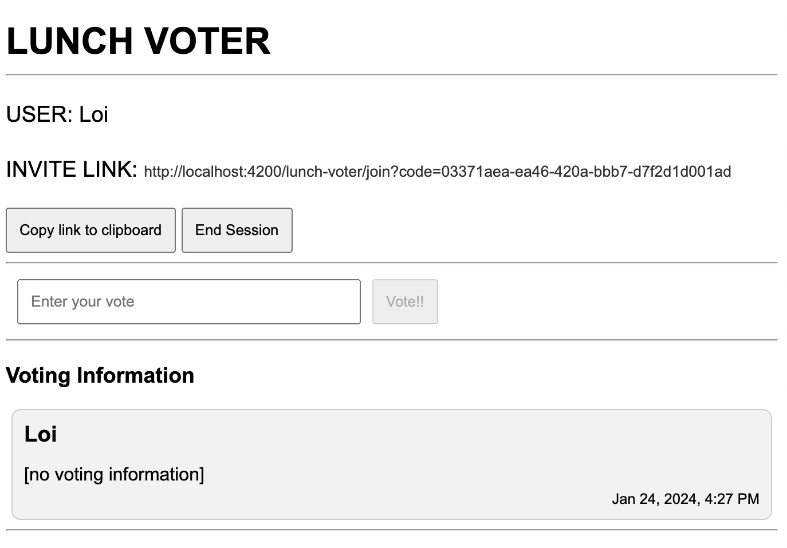

LUNCH VOTER
---

# Lunch Voter (Backend)

## Tech stacks
- [Java 17](https://www.oracle.com/java/technologies/javase/jdk17-archive-downloads.html)
- [Maven 3](https://maven.apache.org)
- [Spring Boot 2.7.5](https://mvnrepository.com/artifact/org.springframework.boot/spring-boot/2.7.5) (web, websocket, data JPA, test)
- Hibernate
- Embedded H2 database
- [Spock/Groovy](https://spockframework.org/) for unit testing
- [Lombok](https://projectlombok.org/)

## Clone source code and setup environment
- Install [Git](https://git-scm.com/).
- Install Maven 3 and Java 17 as mentioned above.
- Make sure JAVA_HOME environment variable is configured and pointing to Java 17 home. Make sure
  [Maven uses Java 17](https://mkyong.com/maven/maven-error-invalid-target-release-17/).

```bash
git clone https://github.com/thangloi2501/lunch-voter.git
cd lunch-voter/lunch-voter-backend
```

## Run the application
```bash
mvn clean
mvn spring-boot:run
```
Backend REST APIs and Websocket messages will be accessible via host:port `http://localhost:8080`

## Test the application
```bash
mvn clean
mvn test
```

## Design documents
- REST APIs
    - [Swagger document](http://localhost:8080/swagger-ui/) is accessible after starting the application.
    - The purpose of REST APIs is providing CRUD methods for frontend to interact with resources
      (vote session, user vote) from backend including: `get all votes from a session`, `create session`, `end
      session`, `join session`, `leave session and submit vote`.
    - Since voting sessions and users are temporary, no need to register for an account before creating
      a voting session. Backend also doesn't manage accounts, so we don't use OAuth, JWT or any other authentication
      mechanism.
    - A temporary `code` for a session and an `userCode` for each user joins the session have been created
      and sent along upon user creates a new session and joins it. Backend bases on these codes to validate
      and identify the session and the user.
    - Currently, we send these codes as POST/PUT request body parameters. Another way is to
      pass them as HEADER attributes, backend will extract the header and validate them.



- Websocket
    - Websocket messages for each vote session produced at: `/ws/topic/vote/{code}`, clients who subscribed
      to will get the realtime updates.
    - There are 2 types of message:
        - `VOTE_INFO`: Contains information about user votes, final vote.
        - `USER_INFO`: Contains information about user actions in session: join, leave, end.
- H2 Database management [console](http://localhost:8080/console) (user:sa, pass: 123) is accessible
  and database schemas are automatically created after application started.

 

---

# Lunch Voter (Frontend)

## Tech stacks

- [Angular 16](https://angular.io/)
- [Node.js v18.19.0](https://nodejs.org/)
- [npm 10.2.3](https://www.npmjs.com/package/npm/v/10.2.3)

## Clone source code and setup environment

- Install [Git](https://git-scm.com/).
- Install npm and Node.js ([v18.19.0](https://nodejs.org/download/release/v18.19.0/)) as mentioned above.
- Install [Angular CLI](https://github.com/angular/angular-cli) version 16.2.3.

```bash
git clone https://github.com/thangloi2501/lunch-voter.git
cd lunch-voter/lunch-voter-frontend
npm install
```

## Run the application

```bash
ng serve
```

Lunch-voter web application will be accessible via host:port `http://localhost:4200`

## Build the application

```bash
ng build
```

The build artifacts will be stored in the `dist/` directory.

## Design modules

- Application includes main Angular components:
    - `Dashboard`: includes
        - `Create Form`: Form to initiate voting session.
        - `Join Form`: Form to join an existing session.
        - `Submit Form`: Form to submit user vote.
        - `Live Board`: Displays realtime voting information.
            - `Vote Info`: Display each user vote.
- REST API client service: CRUD actions to interact with backend.
- Websocket client service: Subscribe to a particular Websocket session's topic.
- Visibility service: Show/hide Live board.

## UI scenarios

1. Creator accesses main page: http://localhost:4200, provides `name`, clicks `Create Session` to create a new Voting session.


2. A new session has been created with `Invite link`. The creator can:
    - `Copy link to clipboard`: to share with other friends to join the session. We can improve
      this feature to send the link via email, sms.
    - `End Session`: to end the Voting session and let system randomly selects one user vote among
      all submitted options. Please note that: All users who joined the session must submit their votes
      before ending this session.
    - `Vote!!`: to submit user vote. User can vote multiple times, the later vote will override the
      previous one.



3. Other users (must use another browser) can access the `Invite link` to join the session, provide `name` and leave the autofill
   session code.


4. After joined the session, user can:
    - `Leave Session`: to leave the session. User vote of this user will be removed from Voting information.
    - `Vote!!`: to submit user vote. User can vote multiple times, the later vote will override the previous one.


5. Everytime an user joined/left the session, there will be a notification broadcasted to all users
   who joined the session.


6. All users who joined the session can see realtime updates of Voting information.


7. The creator waits for all users to submit and clicks `End Session`, system will randomly select an option
   and displays in `green background color`. All users can observe the same final result.
   User can click `New Session` to start a new one.


## Author

Loi Nguyen - loint.sg@gmail.com
