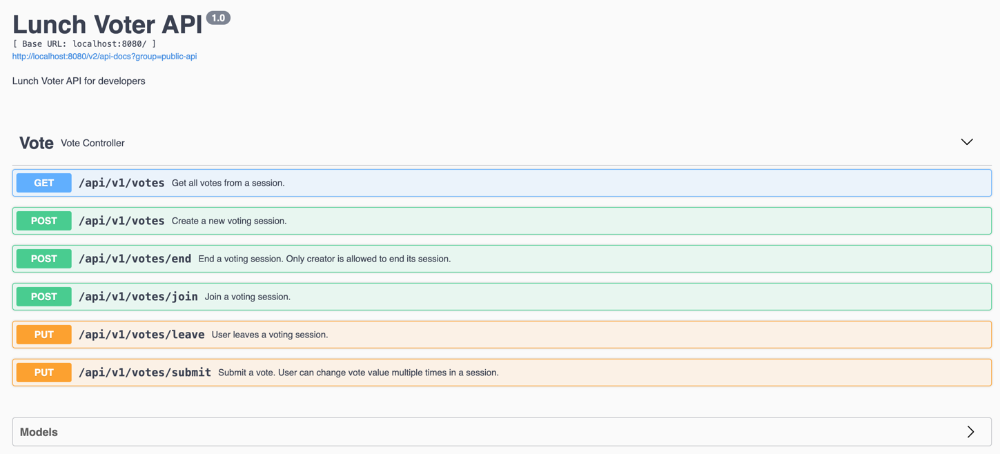
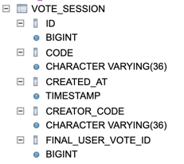
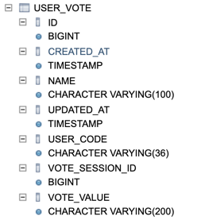

# Lunch Voter (Backend)

## Tech stacks
- [Java 17](https://www.oracle.com/java/technologies/javase/jdk17-archive-downloads.html)
- [Maven 3](https://maven.apache.org)
- [Spring Boot 2.7.5](https://mvnrepository.com/artifact/org.springframework.boot/spring-boot/2.7.5) (web, websocket, data JPA, test)
- Hibernate
- Embedded H2 database
- [Spock/Groovy](https://spockframework.org/) for unit testing
- [Lombok](https://projectlombok.org/)

## Clone source code and setup environment
- Install [Git](https://git-scm.com/).
- Install Maven 3 and Java 17 as mentioned above.
- Make sure JAVA_HOME environment variable is configured and pointing to Java 17 home. Make sure 
[Maven uses Java 17](https://mkyong.com/maven/maven-error-invalid-target-release-17/).

```bash
git clone https://github.com/thangloi2501/lunch-voter.git
cd lunch-voter/lunch-voter-backend
```

## Run the application
```bash
mvn clean
mvn spring-boot:run
```
Backend REST APIs and Websocket messages will be accessible via host:port `http://localhost:8080`

## Test the application
```bash
mvn clean
mvn test
```

## Design documents
- REST APIs
  - [Swagger document](http://localhost:8080/swagger-ui/) is accessible after starting the application.
  - The purpose of REST APIs is providing CRUD methods for frontend to interact with resources 
(vote session, user vote) from backend including: `get all votes from a session`, `create session`, `end 
session`, `join session`, `leave session and submit vote`.  
  - Since voting sessions and users are temporary, no need to register for an account before creating
a voting session. Backend also doesn't manage accounts, so we don't use OAuth, JWT or any other authentication 
mechanism. 
  - A temporary `code` for a session and an `userCode` for each user joins the session have been created 
and sent along upon user creates a new session and joins it. Backend bases on these codes to validate 
and identify the session and the user. 
  - Currently, we send these codes as POST/PUT request body parameters. Another way is to 
pass them as HEADER attributes, backend will extract the header and validate them.
  

  
- Websocket
  - Websocket messages for each vote session produced at: `/ws/topic/vote/{code}`, clients who subscribed 
to will get the realtime updates.
  - There are 2 types of message:
    - `VOTE_INFO`: Contains information about user votes, final vote.
    - `USER_INFO`: Contains information about user actions in session: join, leave, end.  
- H2 Database management [console](http://localhost:8080/console) (user:sa, pass: 123) is accessible
and database schemas are automatically created after application started. 

 
## Contact
Loi Nguyen - loint.sg@gmail.com
