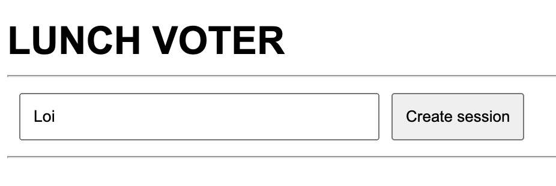
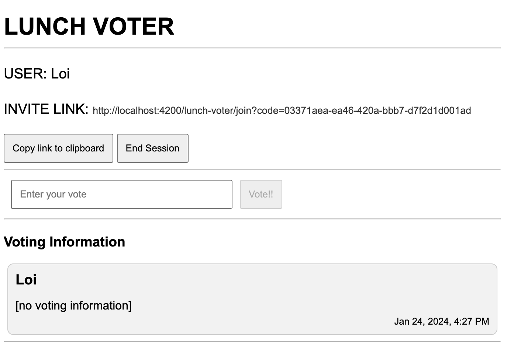
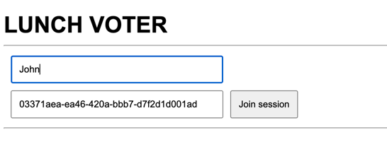
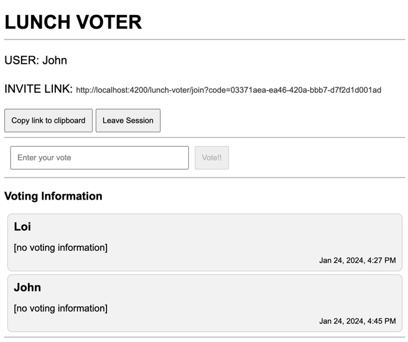
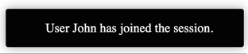
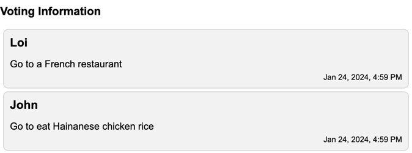
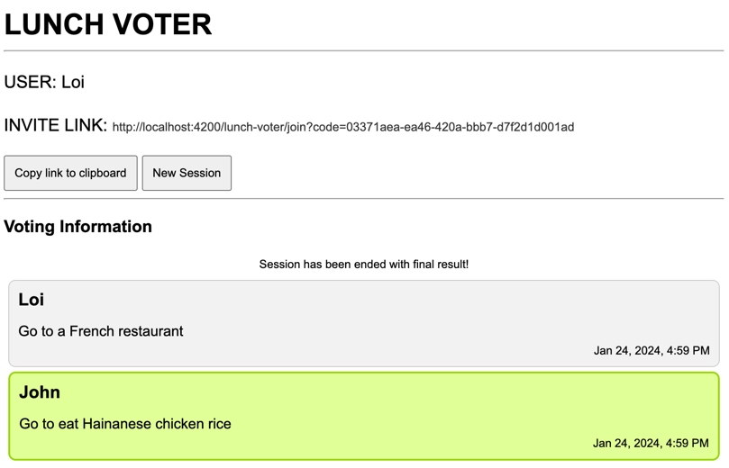

# Lunch Voter (Frontend)

## Tech stacks

- [Angular 16](https://angular.io/)
- [Node.js v18.19.0](https://nodejs.org/)
- [npm 10.2.3](https://www.npmjs.com/package/npm/v/10.2.3)

## Clone source code and setup environment

- Install [Git](https://git-scm.com/).
- Install npm and Node.js ([v18.19.0](https://nodejs.org/download/release/v18.19.0/)) as mentioned above.
- Install [Angular CLI](https://github.com/angular/angular-cli) version 16.2.3.

```bash
git clone https://github.com/thangloi2501/lunch-voter.git
cd lunch-voter/lunch-voter-frontend
npm install
```

## Run the application

```bash
ng serve
```

Lunch-voter web application will be accessible via host:port `http://localhost:4200`

## Build the application

```bash
ng build
```

The build artifacts will be stored in the `dist/` directory.

## Design modules

- Application includes main Angular components:
  - `Dashboard`: includes
    - `Create Form`: Form to initiate voting session.
    - `Join Form`: Form to join an existing session.
    - `Submit Form`: Form to submit user vote.
    - `Live Board`: Displays realtime voting information.
      - `Vote Info`: Display each user vote.
- REST API client service: CRUD actions to interact with backend.
- Websocket client service: Subscribe to a particular Websocket session's topic.
- Visibility service: Show/hide Live board.

## UI scenarios

1. Creator accesses main page: http://localhost:4200, provides `name`, clicks `Create Session` to create a new Voting session.
   


2. A new session has been created with `Invite link`. The creator can: 
   - `Copy link to clipboard`: to share with other friends to join the session. We can improve 
   this feature to send the link via email, sms. 
   - `End Session`: to end the Voting session and let system randomly selects one user vote among 
   all submitted options. Please note that: All users who joined the session must submit their votes 
   before ending this session. 
   - `Vote!!`: to submit user vote. User can vote multiple times, the later vote will override the 
   previous one.
   


3. Other users (must use another browser) can access the `Invite link` to join the session, provide `name` and leave the autofill
session code. 



4. After joined the session, user can:
    - `Leave Session`: to leave the session. User vote of this user will be removed from Voting information.
    - `Vote!!`: to submit user vote. User can vote multiple times, the later vote will override the previous one.
      


5. Everytime an user joined/left the session, there will be a notification broadcasted to all users
who joined the session.




6. All users who joined the session can see realtime updates of Voting information.



7. The creator waits for all users to submit and clicks `End Session`, system will randomly select an option
and displays in `green background color`. All users can observe the same final result. 
User can click `New Session` to start a new one. 



## Contact

Loi Nguyen - loint.sg@gmail.com
